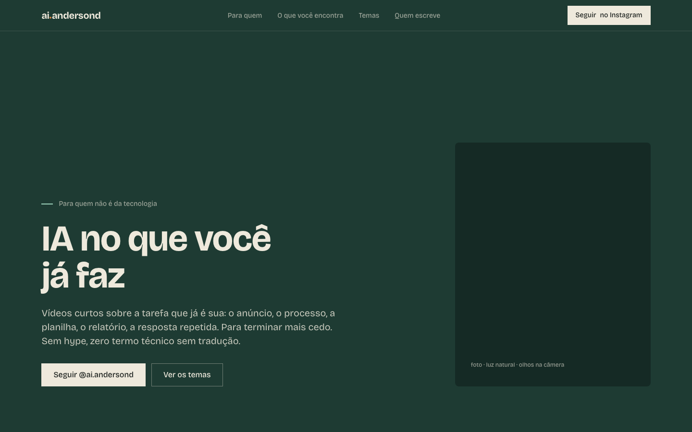

# ai.andersond

Landing page da marca pessoal **@ai.andersond** — IA para quem não é da tecnologia.
Implementa a direção visual **"Lousa"** (v1.0, aprovada em 10/09/2026): verde lousa como base, giz como texto, menta como acento e o cobre só no ponto da marca.



## Stack

- HTML + CSS estáticos. Zero dependência, zero build, zero JavaScript.
- Uma família tipográfica (Bricolage Grotesque) via Google Fonts.
- Roda em qualquer host estático: Vercel, GitHub Pages, Cloudflare Pages.

## Estrutura

| Arquivo | O que é |
|---|---|
| `index.html` | a página inteira, em pt-BR |
| `tokens.json` | fonte normativa dos tokens (W3C Design Tokens) |
| `tokens.css` | os mesmos tokens como variáveis CSS |
| `styles.css` | layout, componentes e responsivo |
| `favicon.svg`, `apple-touch-icon.png` | marca reduzida: o ponto cobre sobre lousa |
| `assets/og.html` → `assets/og.png` | imagem de compartilhamento (1200x630) e sua fonte |
| `AGENTS.md` | regras para quem (ou o que) for editar |

## Identidade em uma tabela

| Token | Hex | Papel |
|---|---|---|
| lousa | `#1E3B33` | fundo padrão |
| lousa escura | `#152A25` | capas, faixa do rodapé, profundidade |
| giz | `#EEE9DC` | texto sobre lousa; fundo da seção "Para quem" |
| grafite | `#1F2421` | texto sobre giz |
| menta | `#9ED3BC` | linha, numeral, uma expressão em destaque |
| cobre | `#D2823F` | só o ponto de `ai.andersond` |

Sem gradiente, sem sombra, sem caixa alta. Raio 0 em tudo, exceto o ponto (2px) e a foto (8px).

## Rodar local

```bash
python3 -m http.server 8000
```

Depois abra `http://localhost:8000`.

## Deploy

- **Vercel:** importar o repo; é detectado como site estático, sem configuração.
- **GitHub Pages:** Settings › Pages › branch `main`, pasta `/ (root)`.

## Pendências (Fase 2 da identidade)

- [ ] **Fotos.** Trocar os dois placeholders (`figure.hero-photo` e `figure.about-photo`) por `` em `assets/fotos/`. Regras: luz natural ou lateral quente, altura dos olhos, plano médio, roupa lisa.
- [ ] **Domínio.** Ao definir, trocar `og:image` e `twitter:image` para URL absoluta e adicionar `<link rel="canonical">`.
- [ ] **Links.** Só Instagram e Aurea estão confirmados. YouTube, LinkedIn e e-mail entram quando existirem.
- [ ] **Frase de bio** (até 150 caracteres, com CTA), pendência do doc de identidade.

## Regenerar o og.png

```bash
"/Applications/Google Chrome.app/Contents/MacOS/Google Chrome" --headless=new --hide-scrollbars --window-size=1200,630 --virtual-time-budget=6000 --screenshot="$PWD/assets/og.png" "file://$PWD/assets/og.html"
```
